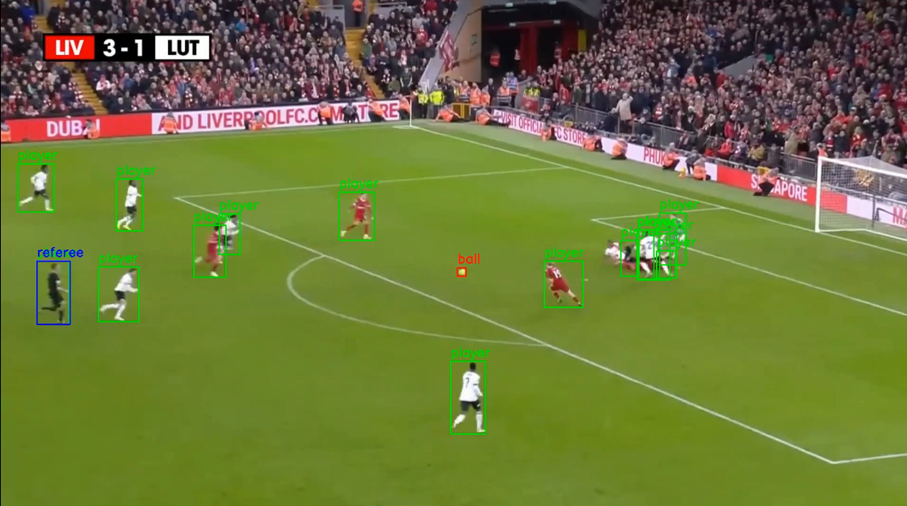
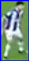
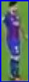
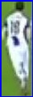
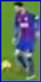
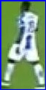
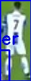
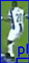
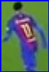
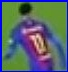

# Advanced Football Match Analysis System

## Project Overview
A comprehensive computer vision and machine learning system for automated football match analysis, featuring real-time object detection, video processing, and image categorization.



## System Components

### 1. Object Detection (`tst.py`)
- Uses YOLOv8x pre-trained model for football scene analysis
- Detects and classifies:
  - Players
  - Ball
  - Referees
- Features:
  - Bounding box visualization
  - Color-coded object classification
  - Individual object cropping
  - Saves processed images with references

### 2. Video Processing (`vid.py`)
- Real-time football video analysis
- Capabilities:
  - Frame-by-frame object detection
  - Performance optimization techniques
  - Configurable frame processing rate
  - Generates annotated output video
- Supports:
  - Ball tracking
  - Player movement detection
  - Referee monitoring

### 3. Image Categorization (`cat.py`)
- Automated image sorting and clustering
- Advanced machine learning techniques:
  - K-means clustering
  - Dominant color extraction
- Categorization features:
  - Team separation
  - Ball detection
  - Miscellaneous image handling
- Intelligent sorting into directories:
  - Team1
  - Team2
  - Ball
  - Others

## Technical Requirements

### Dependencies
- Python 3.8+
- OpenCV
- NumPy
- Scikit-learn
- Ultralytics YOLO
- PIL (Python Imaging Library)

### Recommended Hardware
- GPU for accelerated processing
- Minimum 16GB RAM
- Multi-core processor

## Installation

```bash
# Clone the repository
git clone https://github.com/your-username/football-analysis.git

# Install dependencies
pip install -r requirements.txt

# Download pre-trained YOLO weights
wget https://path-to-your-weights/besttt.pt
```

## Configuration

### Object Detection Model
- Custom YOLOv8x model trained on football-specific dataset
- Supports multiple object classifications
- Configurable detection thresholds

### Video Processing
- Adjustable frame skip rate
- Resize options for performance optimization
- Customizable output video settings

### Image Categorization
- Flexible clustering parameters
- Supports multiple image formats
- Configurable color extraction methods

<div style="display: flex; flex-wrap: wrap; gap: 10px; justify-content: center;">
  
  
  
  
  
  
  
  
  
  
  
  
  
  
  
  
  
  
  
</div>

## Usage Examples

### Image Detection
```bash
python tst.py  # Process single image
```

### Video Analysis
```bash
python vid.py  # Analyze football match video
```

### Image Categorization
```bash
python cat.py  # Automatically sort and categorize images
```

## Advanced Features

### Object Detection
- Precise bounding box generation
- Multi-class object identification
- Performance-optimized processing

### Video Analysis
- Real-time scene understanding
- Dynamic object tracking
- Annotation and visualization

### Image Categorization
- Machine learning-powered clustering
- Intelligent color-based sorting
- Extensible categorization framework

## Potential Applications
- Sports analytics
- Match performance evaluation
- Tactical analysis
- Automated scouting reports
- Training and coaching tools

## Future Roadmap
1. Enhanced machine learning models
2. More sophisticated tracking algorithms
3. Advanced statistical analysis
4. Integration with professional coaching platforms
5. Real-time tactical insights generation

## Limitations
- Requires high-quality input media
- Performance depends on model training
- May struggle with complex, occluded scenes

## Contributing
1. Fork the repository
2. Create feature branch
3. Commit your changes
4. Push to the branch
5. Create pull request

## License
MIT License - See LICENSE.md for details

## Acknowledgments
- Ultralytics for YOLO implementation
- OpenCV community
- Football data research contributors
